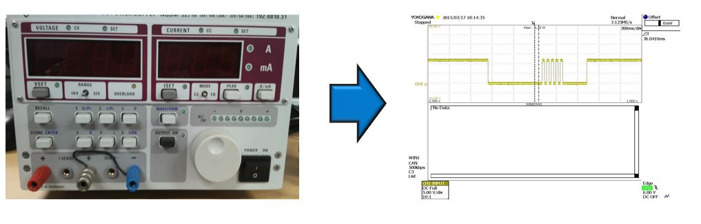
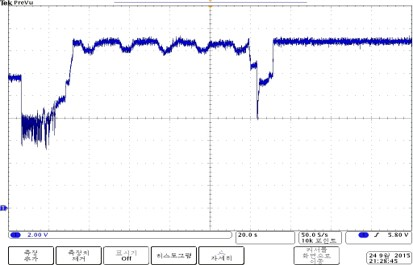
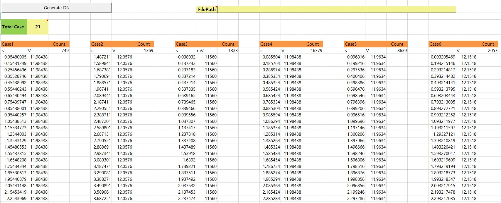
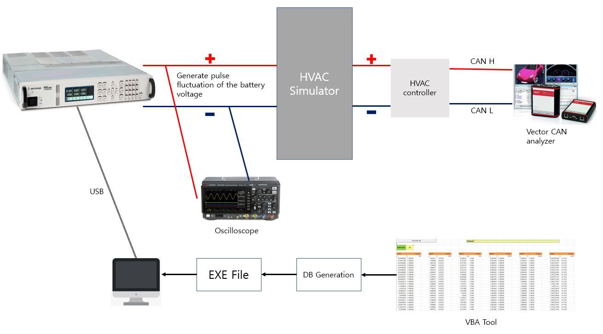

# Tusson (TL_PE), Sportage (QL_PE)

## 1. Project Overview
- Implement a HVAC (Heating Ventilation Air Condition) software program
- I was in charge of the software development of several drivers and applications necessary to the HVAC system

## 2. Development Environment
-  Software Platform developed internally(Adpated OS platform)
-  Compiler: IAR
-  mPD78F1845 16-bit Microprocessor
-  Git, Jira

## 3. Challenging issues / Research and Solution / Result
This section demonstrates what was challenging issues, how to research them, and how to solve them

### Challenge #1 - Automating time-consuming battery power test
As a part of quality standard, our customer asked us to hand in certification reports guaranteeing the functional safety in a situation where battery voltage fluctuates, such as error messages in CAN communication, unexpected change of program variables, and initialization of HVAC controller. This work was quite time-consuming, since the type of voltage fluctuation was over 20 and input duration of each voltage fluctuation was too long. Thus, we needed to automate this time-consuming work to improve work efficiency.

### Approach and Solution #1
**(Step 1)** Designed the concept of the automation of the battery power test 
**(Step 2)** Implemented VBA tool that generates DB files including time and voltage values 
**(Step 3)** Programmed application software that generates the fluctuated voltage values automatically with programmable power supply by Keysight company 
**(Step 4)** Set the environment of battery power test 
**(Step 5)** Evaluated the reported results  

 
<strong>Fig.1) Out of date programmable power supply</strong>

**Fig.1)** shows the pulse generated by old programmable power supply. This supply can only generate limited voltage shapes. Thus, we couldn't response to our customer requirement for more complex voltage fluctuation as shown in **Fig.2)**

 
<strong>Fig.2) the entire block diagram of the combination algorithm</strong>

Also, when our customer gave us an excel document that specifies 21 scenarios of voltage fluctuation, there were too many raw data such as time and voltage values. Entering such raw data to the software program which can be written to the programmable power supply was also time-consuming. So, I developed a software tool that generates DB files automatically by simply ding copy and paste the raw data in the tool through VBA programming. **Fig.3)** shows the software tool. Such generated DB files are called from the software program which is written to programmable power supply.

 
<strong>Fig.3) Software tool generating DB files automatically</strong>

**Fig.4)** demonstrates the entire test environment of the battery power fluctuation. From this test, we can confirm several functional safety.

 
<strong>Fig.4) The entire test environment of the battery power fluctuation</strong>

### Result #1
Improved the efficiency of the time-consuming work by 300%

---
